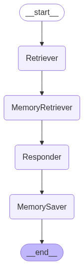

# 🤖 Zubale Technical Assessment

This project is a modular Retrieval-Augmented Generation (RAG) system built using LangGraph and LangChain. It simulates a multi-agent architecture for intelligent querying, answering, and memory storage using an LLM backend. It is designed as part of a technical evaluation to demonstrate clean code, architecture, memory persistence, and prompt chaining.

---

## 📊 Agent Flow

<p align="center">
  
</p>

The diagram above shows the execution flow of the system:

1. **Retriever**: Fetches relevant documents based on the user query using FAISS and HuggingFace embeddings.
2. **MemoryRetriever**: Retrieves past conversation history for the user by the user_id from SQLite.
3. **Responder**: Uses the context and history to generate an answer using a language model (e.g., GPT-4 or HuggingFace).
4. **MemorySaver**: Persists the interaction (query, answer, history) to the database to maintain continuity.

This architecture is orchestrated with **LangGraph**, which enables declarative control flow between agents using a directed graph structure.


---

## 🚀 Features

- Retrieval-Augmented Generation (RAG)
- Modular agent design:
  - RetrieverAgent
  - MemoryRetrieverAgent
  - ResponderAgent
  - MemorySaverAgent
- Persistent memory with SQLite
- FastAPI backend with OpenAPI documentation
- Local vector store using FAISS
- Hugging Face embeddings integration
- Unit tests with `pytest`
- Dockerized setup

---

## 🗂️ Project Structure

```text
ZubaleTechnicalAssessment/
├── agents/              # RAG agents
├── graph/               # LangGraph configuration
├── app/                 # General app functionalities and paramaters
├── documents/           # Products documents with information about simulated products
├── tests/               # Unit tests
├── main.py              # FastAPI entrypoint
├── example_query.py     # Example request to test the app
├── conversation.db      # SQLite DB
├── Dockerfile           # Docker container config
├── requirements.txt     # Dependencies
├── README.md            # Project documentation
└── .env                 # Environment variables
```


---

## ⚙️ Setup Instructions

### 1. Clone the repository

```bash
git clone https://github.com/RicardoMolinaCoronel/zubale-technical-assesment.git
cd ZubaleTechnicalAssessment
```

### 2. Create and activate a virtual environment or use Pycharm IDE
```shell
python3 -m venv .venv
source .venv/bin/activate    # On Windows: .venv\Scripts\activate
```

### 3. Install dependencies
```shell
pip install -r requirements.txt
```

### 4. Copy de .env.example file in your own .env file with your parameters
```shell
EMBEDDING_MODEL=all-MiniLM-L6-v2
LLM_MODEL=gpt-4-turbo
TOP_K=1
OPENAI_API_KEY=your-openai-api-key
```

### 5. Running the aplication
```shell
uvicorn main:app --reload --port 8001  
```

### 🧪 Running Tests
You can run the tests one by one inside the tests folder to verify each component individually.
But if you want to run all the tests

Linux/Mac
```bash
PYTHONPATH=. pytest   
```
Windows
```bash
$env:PYTHONPATH = "."
pytest
```

### 🐳 Docker
Or you can simply run the project with docker
```bash
docker build -t zubale-app .
docker run -p 8001:8001 zubale-app
```

## Example API Query

**Endpoint:**

```http
POST /query
Content-Type: application/json
```

**Request body:**

```json
{
  "query": "What is the price of a SmartSpeaker?",
  "user_id": "test_user_1"
}
```

**Response:**

```json
{
  "query": "What is the price of a SmartSpeaker?",
  "user_id": "test_user_1",
  "docs": [...],
  "answer": "The price of the SmartSpeaker X200 is $295.",
  "history": [...]
}
```
## Test the example with curl

Windows
```bash
curl -X POST http://127.0.0.1:8000/query -H "Content-Type: application/json" -d "{\"user_id\": \"user123\", \"query\": \"What is the price of the SmartSpeaker?\"}"
```

Mac OS
```bash
curl -X POST http://127.0.0.1:8000/query -H "Content-Type: application/json" -d '{"user_id": "user123", "query": "What is the price of the SmartSpeaker?"}'
```
## Or with example_query.py
```bash
python example_query.py
```

## 🛠️ Tech Stack

| Tool/Library       | Purpose                          |
|--------------------|----------------------------------|
| Python 3.12        | Core programming language        |
| FastAPI            | Backend framework (API)         |
| LangChain          | LLM framework                    |
| LangGraph          | Agent flow orchestration         |
| FAISS              | Vector similarity search         |
| HuggingFace        | Embedding models                 |
| SQLite             | Persistent storage               |
| Docker             | Containerization                 |
| Pytest             | Testing framework                |

---


## ⏱️ Time Spent

| Task                                                                                         | Estimated Time |
|----------------------------------------------------------------------------------------------|----------------|
| 🔧 Initial setup and folder structure                                                        | 0.5h           |
| 📦 Implementation of RAG agents (`Retriever`, `Responder`, `MemoryRetriever`, `MemorySaver`) | 1.5h           |
| 🧠 FAISS + HuggingFace embeddings integration                                                | 0.5h           |
| 🧩 LangGraph flow construction and agent connections                                         | 0.5h           |
| 📝 Prompt engineering and conversational history formatting                                  | 0.5h           |
| 🗃️ User-specific memory persistence using SQLite                                            | 0.5h           |
| 🧪 Unit tests                                                                                | 2h             |
| 🐳 Dockerization                                                                             | 0.25h          |


---
## 👨‍💻 Author

**Ricardo Molina Coronel**  
[🔗 LinkedIn](https://www.linkedin.com/in/ricardo-duval-molina-coronel)


